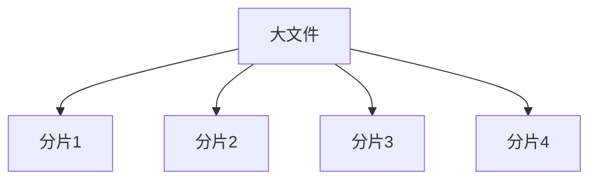

## 1. 文件上传

上传大文件时，以下几个变量会影响我们的用户体验

* 服务器的处理能力
* 请求超时
* 网络的波动 （可能一下很慢，一下很快）

所以 针对大文件 就涉及到两个概念： **断点续传** 和 **分片上传**。

**分片上传**

简单理解： 就是把一个大的文件按照一定的大小来分成很多个小文件（分片）来上传。上传完之后再由服务端对所有上传的文件进行汇总整合成原始的文件。

如图：



大概流程：

1. 将需要上传的文件按照一定的分割规则，分割成相同大小的数据块；
2. 初始化一个分片上传任务，返回本次分片上传唯一标识；
3. 按照一定的策略（串行或并行）发送各个分片数据块；
4. 发送完成后，服务端根据判断数据上传是否完整，如果完整，则进行数据块合成得到原始文件。

**断点续传**

简单理解： 上传或下载过程中 ，人为的分成几个部分，每一个部分采用一个线程进行上传或下载，如果因为外部原因，出现问题，则不需要从头开始下载。为用户节约时间，提高速度。

在这个过程当中，如果断开了，我们需要知道从哪里开始，可以

* 服务端返回
* 前端自己处理

重新上传该部分，直到上传完成。一般我们在上传成功之前都将文件保存成临时文件 ，以作区分。上传完成了，改为正式文件。

## 2. 实现

```js
// 页面有一个文件框
<input type="file" onchange="onChange(event)">

// 使用 new FileReader 读取文件
function onChange(event) {
  const file = event.target.files[0]; // 拿到文件
  const reader = new FileReader();  // 实例化文件对象
  reader.readAsText(file);  // 读取文件
  const totalSize = file.size
  const size = 5 * 1024 * 1024; // 以5MB为一个分片
  const total = file.size / size // 总的分为几片
  reader.onload = function(event) {
    // 文件里的文本会在这里被打印出来
    console.log(event.target.result)
    const result = event.target.result
   // 切片
       for(const idx = 0,idx <= total; idx++){
           let end = size * (idx + 1)
           if(end >= file.size){
               end = file.size
           }
           const chunk = result.slice(size * idx,end)
           //拿到切片 可以进行上传
           const formdata = new FormData();
           formdata.append(idx, chunk);
           // 识别当前分片属于哪一个文件
           formdata.append('fileId',new Date().getTime())
           // 调用接口上传
           $.ajax({
                    url: 'http://localhost:9999/test.php',
                    type: 'POST',
                    data: formData,
                }).done(function(res){

                }).fail(function(res) {

                });
           }
       }
  };

}
```

为了提示用户，我们需要追加进度条 , 利用`reader.onprogress` 即可：

```js
reader.onprogress = (e)=> {
    console.log(e)
    console.log(e.loaded) // 上传成功了多少
  }
```

注：[FileReader - Web API 接口参考 | MDN ](https://developer.mozilla.org/zh-CN/docs/Web/API/FileReader)


## 3. 使用场景

* 大文件上传： 当文件大小超过预期大小时，使用分片上传可实现并行上传多个 Part， 以加快上传速度。

* 网络环境差： 断点续传。当出现上传失败的时候，仅需重传失败的部分。
